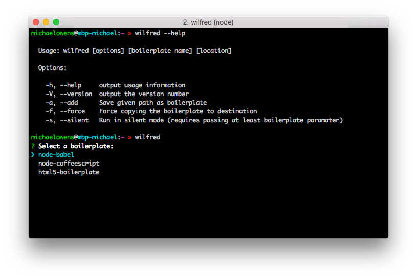

# Wilfred

A local boilerplate manager. Add folders as boilerplates and initialize projects from them using your terminal.

## What exactly is Wilfred?

Wilfred is a simple [boilerplate](https://en.wikipedia.org/wiki/Boilerplate_code) manager. Similar to yeoman, but works with local folders. Add an existing folder as boilerplate and you're ready to go, no internet required.

## Installation

`npm install -g wilfred`

## Usage

For more information on how to use wilfred run `wilfred --help`

## Features

- [x] Local folders
- [x] Interactive and non-interactive mode[1](#footnote1)
- [x] `.wilfredhook` for running commands after copy
- [ ] GitHub support
- [ ] `.wilfredignore` for files to ignore during copy (maybe?)

<a name="footnote1">1</a>: If you pass in the boilerplate name as argument it will run non-interactive. If you don't it will run in interactive mode.

## Changelog

### 0.1.6

- Stop using os.homedir() for backwards compatibility
- Fix issue where hook would run from parent directory when using wilfred to make project folder

### 0.1.5

- Fix issue where `-s` did not silence all output
- Add support for `.wilfredhook` file, which will run after copying

### 0.1.4

- Fix error when using wilfred without boilerplates added

### 0.1.3

- Add `-r / --remove` option to remove a boilerplate
- Fix being able to add boilerplates with the same name

### 0.1.2

- Fix issue where first boilerplate was not automatically selected in interactive mode
- Fix error when destination folder does not exist

### 0.1.1

- Add `-l / --list` option to get a list of all added boilerplates
